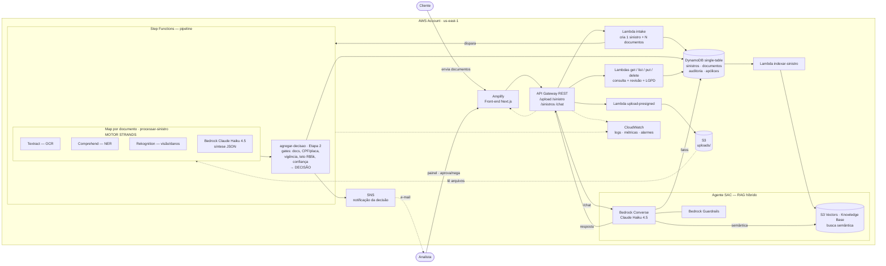

# Diagrama de arquitetura — DocuSmart Intelligence

Diagrama em Mermaid (renderiza no GitHub e em editores Markdown). Reflete o que
está de fato implementado: dois atores, Step Functions orquestrando a extração +
a decisão (Etapa 2), notificação por SNS, e o agente SAC com Guardrails.

## Legenda do fluxo

1. **Cliente** envia o pacote pela página pública (Amplify) → `upload-presigned` (URL
   assinada) → `PUT` no **S3** → `intake` cria **1 sinistro + N documentos** e dispara o
   **Step Functions**.
2. **Step Functions**: `Map` por documento → **processar-sinistro** (Motor Strands:
   Textract, Comprehend, Rekognition + Bedrock Haiku 4.5) → **agregar-decisao** (Etapa 2:
   gates + decisão).
3. A decisão grava no **DynamoDB** e **publica no SNS** (e-mail ao cliente/equipe).
4. **Analista** acompanha no painel e revisa via `put`/`delete` (LGPD); `get-sinistro`
   ainda devolve uma URL presigned para **ver o documento original**.
5. **Agente SAC**: `/chat` → **Bedrock Converse** com **Guardrails**, combinando **fatos do
   DynamoDB** + **busca semântica no S3 Vectors** (RAG híbrido; indexação via
   `indexar-sinistro`).
6. **CloudWatch** observa tudo (logs, métricas, alarmes) — ver `scripts/cloudwatch_dashboard.py`.
